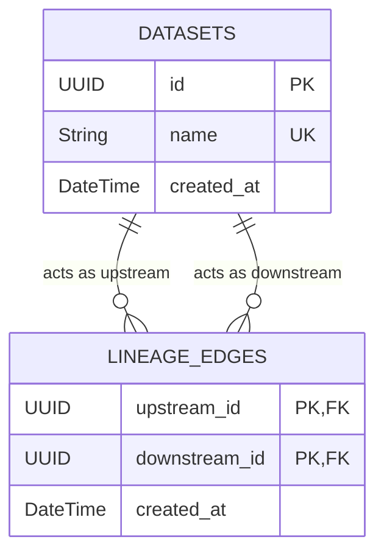
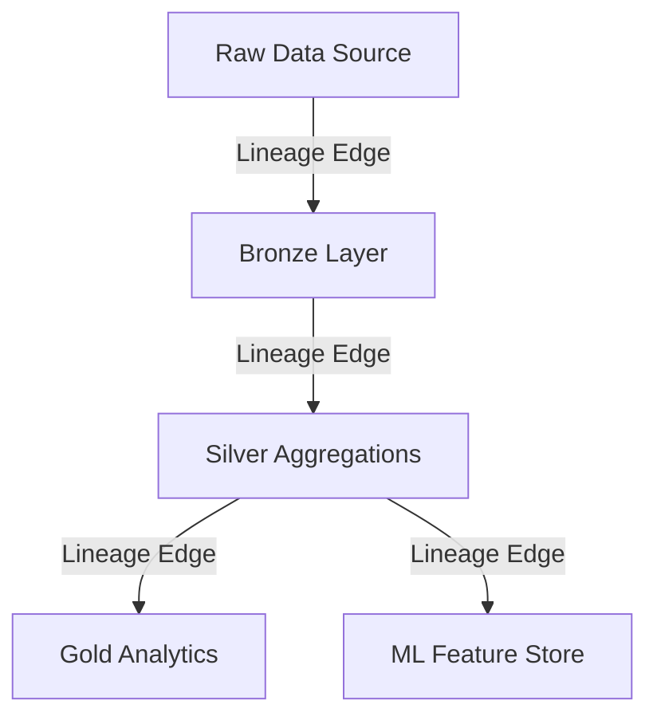

# Data Lineage Tracker

A robust, high-performance API built with **FastAPI** and **async SQLAlchemy** to track and manage data lineage. The system models data assets and their dependencies as a Directed Acyclic Graph (DAG) backed by PostgreSQL, preventing cyclical dependencies and providing deep impact & root cause analysis capabilities.

## Features
- **Dataset Management:** Register and track data assets.
- **Lineage Tracking:** Map `upstream` and `downstream` relationships.
- **Cycle Prevention:** Automatically detects and prevents cyclical dependencies from being created.
- **Impact Analysis:** Recursively traverse the graph to find all downstream assets affected by a dataset.
- **Root Cause Analysis:** Traverse upstream paths to trace data origins.

---

## Architecture & Data Model

The application uses an adjacency list pattern to represent the computational DAG. 

### Entity-Relationship Diagram



### Lineage DAG Concept



---

## Getting Started (Dockerized Environment)

The easiest way to run the application is via Docker Compose.

### Prerequisites
- Docker & Docker Compose installed on your system.

### 1. Configure the Environment
Ensure your `src/.env` file is properly configured. A sample configuration:
```env
API_NAME=Data Lineage Tracker
API_VERSION=1.0.0
DATABASE_PORT=5432
DATABASE_HOST=postgres
DATABASE_NAME=data_lineage_tracker
DATABASE_USER=postgres
DATABASE_PASSWORD=postgres
TEST_DATABASE_NAME=data_lineage_tracker_test
```

### 2. Build and Start the Services
Run the following command from the root of the project (where `docker-compose.yml` is located):
```bash
docker compose up --build -d
```
Docker will spin up the PostgreSQL database and the FastAPI application. Alembic migrations are automatically run during container startup.

### 3. Access the API
Once the containers are healthy, you can access the interactive Swagger API documentation at:
👉 **[http://localhost:8000/docs](http://localhost:8000/docs)**

---

## Running Tests

The project uses `pytest` and `pytest-asyncio` for automated testing. To prevent altering development data, tests are executed against an isolated test database.

### 1. Create the Test Database
Execute the following command to create the test database inside the running PostgreSQL container:
```bash
docker compose exec postgres psql -U postgres -c "CREATE DATABASE data_lineage_tracker_test;"
```

### 2. Run the Test Suite
If you are developing locally with a Python virtual environment, ensure it is activated and the `src/` directory is in context:
```bash
source env/bin/activate
cd src
pytest
```

*(Note: The test suite is configured via `pytest.ini` to automatically drop and recreate tables before and after test runs to ensure a clean state).*